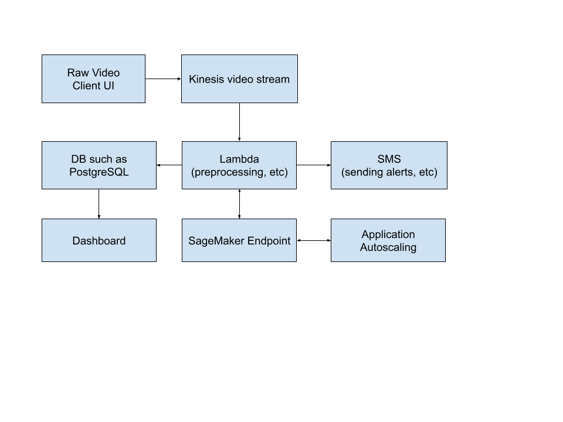

# Problem Statement
A surveillance camera company uses computer vision to detect objects and people in live footage. They are already using a computer vision model on ec2 (cpu) instances with autoscaling and processing the videos in near real time and they process the frames of the landed videos using one second frequency sampling. Their model works accurately, but as a result of company growth their AWS spending has been increasing rapidly. Now they would like to reduce their cost.

What would you suggest for them to do first? Is there a rough architecture that you can come up with to solve this problem on AWS?

# Discussion
In order to reduce the number of instances required, we can think about way to improve speed and efficiency of the model. This could be achieved by:
* Using a GPU instance instead of a CPU instance.
* Using a smaller instance type if the EC2 instances are not being fully utilised.
* Quantising the weights of the model. This will reduce the size of the model and the amount of memory required.
* Consider model distillation, where we train a smaller faster model that can be used to replace the original model.
* Test reducing the resolution of the video frames. Maybe introduce a preprocessing step that determines if frame rate can be reduced without sacrificing accuracy.
* Increase the batch size to test more frames in a single call.

## Architecture
We could consider moving away from EC2 entirely and utilise a serverless architecture. For example we could use AWS Lambda and SageMaker endpoints. GPUs are not able to be used with Lambda but we could deploy the model using a SageMaker endpoints with GPU instances. Depending on how the video is acquired, we could use AWS Kinesis video streams to stream the video frames to the Lambda. AWS application scaling can be used to scale the SageMaker endpoint as required. The Lambda would be the entry point for the video processing and would be responsible for any preprocessing of the video frames such as reducing the resolution. The SageMaker endpoint would be responsible for the actual model inference. The Lambda could call SNS to send notifications, assuming the company wants to be alerted of specific detection events. In addition to this, the Lambda can store results of the inference in a DB for later analysis. A dashboard would use the DB to show near realtime insights and analytics. The DB would also be utilised for later offline analysis for model improvements, and analysis of AB testing in the case where we are running champion/challenger models. 

# Recommendation
The first thing to try is using GPU instances with increased batch size to improve throughput, followed by quantising the model weights. If more savings are required, then we would implement the serversless architecture approach detailed above.

The serverless architecture approach detailed above would be expected to be the more cost effective solution as Lambda only occurs costs when it's executing, and the SageMaker endpoints can scale down as demand drops. There is also the advantage of not having to maintain and upgrade operating systems and software as would have to be done when maintaining a fleet of EC2 instances.

