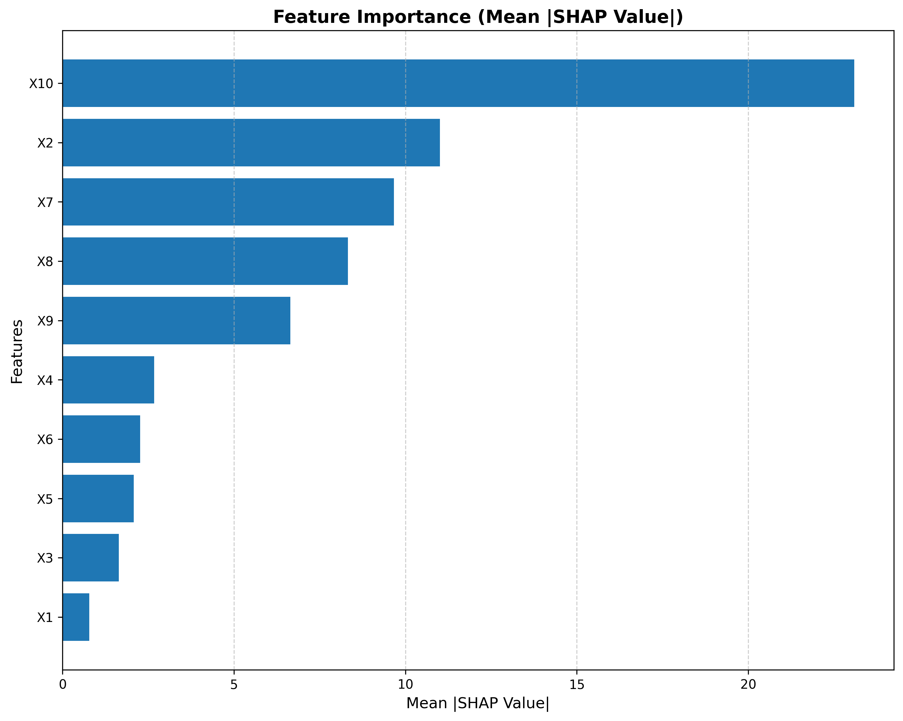

# EDA

The packange `ydata-profiling` was used to explore the training features:
* We have 10 numeric features and 1 categorical feature. 
* There are no missing values.
* The distributions of the numeric features are all uniform, each feature having a unique range.
* There are no real correlations between the features.
* All values are unique
* The target variable appears normally distributed but slightly skewed.
* The is a slight difference (0.006%) in mean and median of the target variable due to the skew.

The output of the profiling report is in `profile_report.html`.

# Model Building
The `tensorflow` package was used (due to familiarity). The model building and analysis was done in a jupyter notebook, `build_model.ipynb`. This has been exported to a **python script** `build_model.py` as we would use a script in production rather than a notebook. 

The numerical inputs are normalised and the categorical input is one-hot encoded. The `tensorflow` routines were used for this as the parameters can be packaged with the model. The model concatenates the numeric and categorical features and then passes them through a series of dense layers with dropout and batch normalisation. L1 and L2 regularisation was used to prevent overfitting (maybe a little overkill for this project). After a little experimentation the layers consisted of 256, 128, 64, 32, 16 units. The model has a total of `13,844` trainable parameters. Early stopping was for efficiency and to prevent overfitting. Although the `epochs` were set to 100, early stopping stopped the training after 14 epochs, taking the weights after epoch 6. These epoch numbers may vary slightly with each model build. 


The Mean Absolute Error (MAE) on test data was **16.1** although this will vary with each model build due to the random initialisation of the model weights.
A feature significance analysis was also performed using the `SHAP` library. The showed that the feature `X10` was the most significant. It is noted that `X10` is the only categorical feature. `X4` was the most significant numeric feature, while `X1` was the least significant numeric feature, hardly making any contribution. It is noted that with different model builds and architectures, the feature importance may vary, but `X1` was the least significant feature in all cases tested.




# API
The `FastAPI` library was used to create an API to serve the model. The API reads `dius_model.keras` and `categorical_mapping.joblib` which were created by the `buid_model.ipynb` notebook.

The API is started using:
```bash
python serve.py
```

A test script is provided in `test_api.py`. This shows how the API can be used. The only change that needs to be made when using the API running in the
docker container, is to change the port number if running on a different port. The docker container will use port 5000 by default.

The output of the `test_api.py` script is:
```bash
Testing DiUS ML Model API...
Health check status: 200
Response: {'status': 'Yes master, whay is thy bidding?'}
Loaded test data with 1000 rows and 11 columns

--- Testing Single Prediction ---
Single prediction status: 200
Response: {'prediction': 862.1929931640625}

--- Testing Batch Prediction (JSON) ---
Batch prediction status: 200
Response: {'predictions': [862.1929931640625, 717.689208984375, 914.5354614257812, 871.4234619140625, 793.2154541015625]}

--- Testing Batch Prediction (CSV) ---
CSV prediction status: 200
Predictions saved to api_predictions.csv
First 5 predictions:
   prediction
0  862.192993
1  717.689209
2  914.535522
3  871.423523
4  793.215515

All tests completed!
```

# Docker
Using `podman` to build and run the Docker image locally:
```bash
podman build -t dius-ml-model-api:latest .
podman run -d -p 5000:5000 dius-ml-model-api:latest
```
The API will be available at `http://localhost:5000` and the test script detailed above can be used to test the container.

Note: using **Podman** due to licencing restrictions on **Docker Desktop**.

# Discussion
If another modeling method could be used, we could try **XGBoost** or **LightGBM**. Tree methods have been show to often outperform deep learning models for this type of problem. For more details see [https://arxiv.org/abs/2207.08815](https://arxiv.org/abs/2207.08815).
We could also try dropping the least significant features as this *may* improve performance and stability, particularly if the least significant features are only really contributing noise.

Note: `README.md` was converted to `README.pdf` using `pandoc`.

